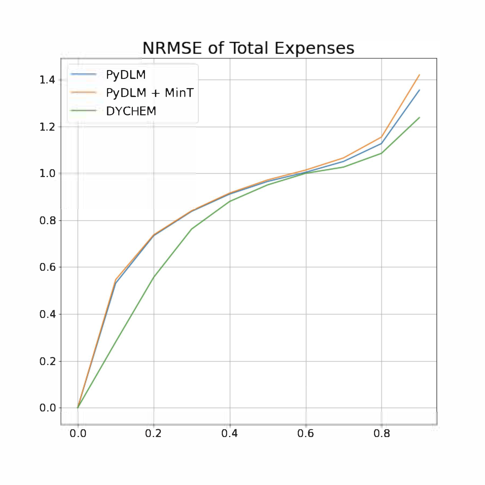
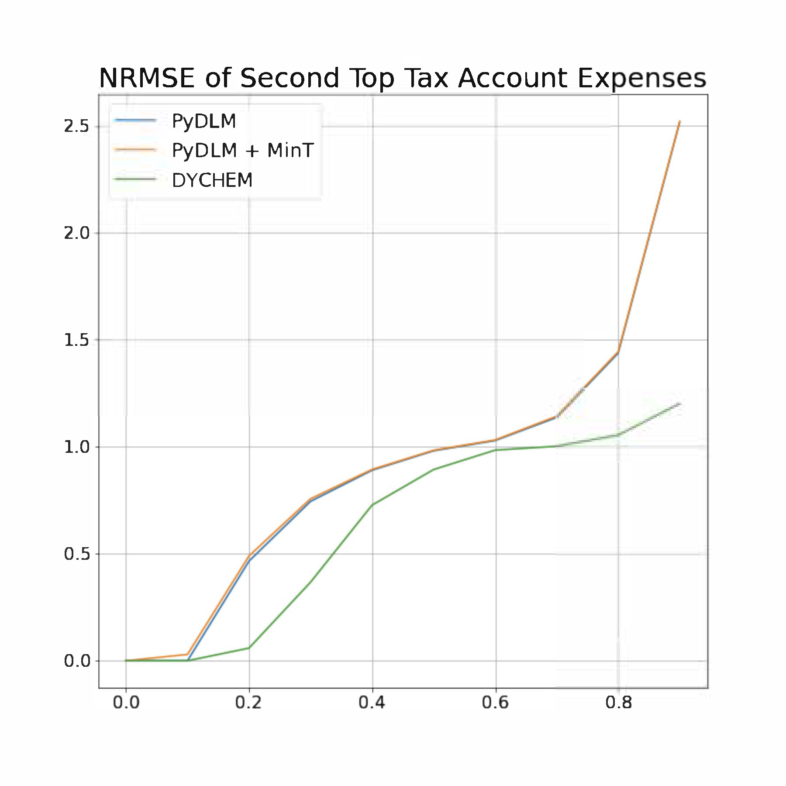
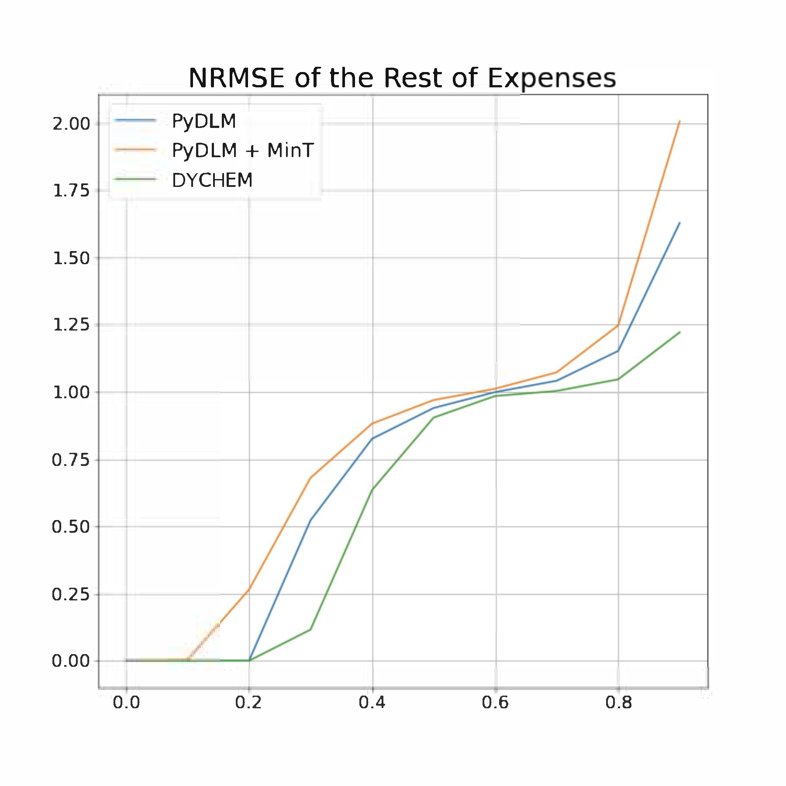

# Accelerated DYCHEM

This program is an implementation of DYCHEM with acceleration, using multi-threading and multi-GPU parallelization.

## Run Experiments
After setting up the environment, run experiment using the following command:

```
python run_dychem_acc.py
```

### Unit Test
To perform unit testing, run the following command under the [`tests`](./tests/) folder:
```
pytest test_htsf.py
```

## Experiment Details

Currently, available experts employed in accelated DYCHEM include:

- PyDLM
- FB-Prophet
- Auto-ARIMA
- Naive Average

The code also contains implementations of deep forecasters but they are not included due to computaitonal efficiency. The following figures compare DYCHEM with currently depolyed baselines of a large financial software company measured by NRMSE. Each figure represents the cumulative value of NRMSE distribution over 12,000 users (one user owns one HTS) at each percentile. The hierarchy contains one top-level vertex with 4 child vertices.



Below shows the percentage of each expert with the highest weight in one experiment.


## Troubleshooting
If you have further questions on implementation details, please contact aaronhan223@utexas.edu