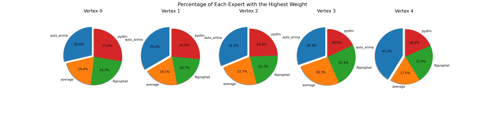

# Accelerated MECATS

This program is an implementation of MECATS with acceleration, using multi-threading and multi-GPU parallelization.

## Run Experiments
After setting up the environment, run experiment using the following command:

```
python run_mecats_acc.py
```

### Unit Test
To perform unit testing, run the following command under the [`tests`](./tests/) folder:
```
pytest test_htsf.py
```

## Experiment Details

Currently, available experts employed in accelated MECATS include:

- PyDLM
- FB-Prophet
- Auto-ARIMA
- Naive Average

The code also contains implementations of deep forecasters but didn't included due to computaitonal efficiency. Below shows the percentage of each expert with the highest weight in one experiment.



## Troubleshooting
If you have further questions on implementation details, please contact aaronhan223@utexas.edu