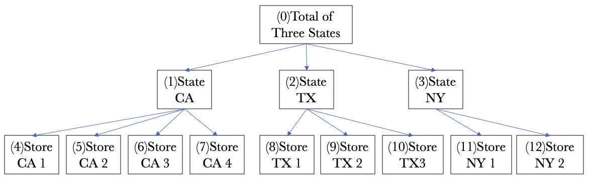

# Hierarchical Time Series Forecasting

This repository contains implementations of hierarchical time series forecasting methods in the following papers:

- [Simultaneously Reconciled Quantile Forecasting of Hierarchically Related Time Series](https://arxiv.org/pdf/2102.12612.pdf)
- Dynamic Combination of Heterogeneous Experts for Hierarchical Time Series (in submission)

## Running Instructions

To setup conda environment for running the program, use the following command:
```
conda env create -f htsf.yml
```
Activate the new environment:
```
conda activate htsf
```

## Implementation Details
This repository compares forecasting performance across benchmarked hierarchical time series (HTS) approaches on various real-world and simulated hierarchiclly related time series data.

### Input Format
HTS is a special type of multi-variate time series which has a predefined hierarchical structure between each variant. Below is an example of HTS with 13 variants, each variant could be e.g., a univariate time series that describes sales record at the corresponding level.




Input format on this example:
- `HTS data`: a Pandas DataFrame object, use numbers within bracket as feature names.
- `Hierarchical structure`: a list that includes the number of children of each non-leaf vertex: [[3], [4, 3, 2]].

### Datasets
- [Australian Labour Force](https://www.abs.gov.au/ausstats/abs@.nsf/mf/6202.0)
- [Predict Future Sales](https://www.kaggle.com/c/competitive-data-science-predict-future-sales/data)
- [Web Traffic Time Series Forecasting](https://www.kaggle.com/c/web-traffic-time-series-forecasting)
- [M3 Competition Data](https://forecasters.org/resources/time-series-data/m3-competition/)
- [AEdemand Data](https://cran.r-project.org/web/packages/thief/thief.pdf)

### Other Related Works
- [Bottom up (BU)](https://robjhyndman.com/papers/MinT.pdf)
- [Trace Minimization (MinT)](https://robjhyndman.com/papers/MinT.pdf) including shrinkage, sampling and OLS estimators
- [Empirical risk minimization (ERM)](https://souhaib-bentaieb.com/papers/2019_kdd_hts_reg.pdf)
- [HTS prophet](https://github.com/CollinRooney12/htsprophet)